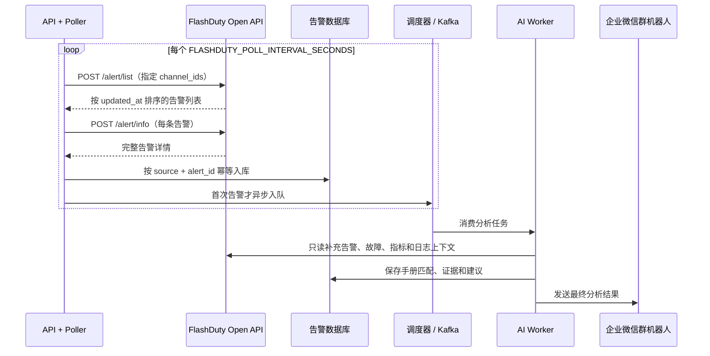

# FlashDuty Open API 轮询接入

本服务**仅通过 FlashDuty Open API 轮询告警**：服务主动调用 `/alert/list` 和 `/alert/info`，不再提供或使用 FlashDuty 入站 Webhook。部署无需公网回调地址、Nginx 入站反代、TLS 回调证书或 `X-FlashDuty-Token`。

## 数据流



## 一、部署前提

- 本机或容器必须能通过 HTTPS（TCP 443）**出站**访问 `https://api.flashcat.cloud`；无需接受外部入站流量。
- 在 FlashDuty 中创建最小权限的只读 APP Key，避免授予创建、更新、认领、恢复或删除权限。
- 在 `.env` 中填写至少一个本服务负责的协作空间 ID。未配置协作空间范围时，服务就绪检查会失败，轮询器不会启动。
- 如果网络需要代理，可为服务进程配置 `HTTPS_PROXY` 与 `NO_PROXY`；不要把 APP Key 写入日志、前端或 Git。

## 二、`.env` 配置

复制模板：

```bash
cp .env.example .env
```

配置 FlashDuty：

```dotenv
# 启用 FlashDuty 只读 API 轮询
FLASHDUTY_ENABLED=true
FLASHDUTY_BASE_URL=https://api.flashcat.cloud
FLASHDUTY_APP_KEY=replace-with-read-only-app-key
FLASHDUTY_TIMEOUT_SECONDS=40
FLASHDUTY_MAX_RETRIES=2

# 轮询配置；单位为秒。当前最小间隔为 300 秒。
FLASHDUTY_POLLING_ENABLED=true
FLASHDUTY_POLL_INTERVAL_SECONDS=300
FLASHDUTY_POLL_LOOKBACK_SECONDS=900

# 必填：仅拉取这些 FlashDuty 协作空间中的告警。
# 支持 JSON 数组或逗号分隔形式，例如 123456789,987654321。
FLASHDUTY_POLL_CHANNEL_IDS=[123456789]

# 可选：进一步仅拉取指定集成产生的告警。
FLASHDUTY_POLL_INTEGRATION_IDS=[]
```

### 关键配置语义

| 配置 | 作用 | 约束与建议 |
| --- | --- | --- |
| `FLASHDUTY_POLL_CHANNEL_IDS` | 指定协作空间范围，传给 `/alert/list` 的 `channel_ids` | **启用轮询时必填**；空值会导致 `/health/ready` 返回 503 且轮询器不启动 |
| `FLASHDUTY_POLL_INTERVAL_SECONDS` | 每轮拉取的间隔 | 单位秒，最小 300；由 `.env` 控制，修改后重启 API 生效 |
| `FLASHDUTY_POLL_LOOKBACK_SECONDS` | 每轮回看的重叠窗口 | 建议不小于轮询间隔；默认 900 秒，用于覆盖网络波动、API 重试和进程重启 |
| `FLASHDUTY_POLL_INTEGRATION_IDS` | 集成过滤范围 | 可选；空数组表示不额外按集成过滤，但始终按协作空间过滤 |

## 三、启动服务

Docker Compose：

```bash
docker compose up -d --build
docker compose logs -f api
```

本地直接运行：

```bash
alembic upgrade head
uvicorn app.api.main:app --host 127.0.0.1 --port 8000
```

检查就绪状态：

```bash
curl -i http://127.0.0.1:8000/health/ready
```

成功时返回：

```json
{"status":"ready","issues":[]}
```

如未配置协作空间 ID，响应会包含：

```text
FLASHDUTY_POLL_CHANNEL_IDS must contain at least one collaboration space ID
```

## 四、轮询与去重语义

### 协作空间过滤

每一轮请求均固定携带 `.env` 中的 `FLASHDUTY_POLL_CHANNEL_IDS`，因此服务不会因为 APP Key 权限过大而拉取未指定协作空间的告警。`FLASHDUTY_POLL_INTEGRATION_IDS` 仅是额外收窄范围，不能替代协作空间 ID。

### 基于告警 ID 的幂等

每条 FlashDuty 告警以如下复合键作为本地唯一身份：

```text
source = "flashduty"
external_id = FlashDuty alert_id
```

轮询器对每个 `/alert/list` 项优先调用 `/alert/info`，再交给统一入站服务保存。首次见到某个 `alert_id` 时创建本地告警并入队分析；后续重叠窗口、下一轮扫描或 API 重试再次返回同一 `alert_id` 时，数据库返回已有记录，**不会创建第二条告警或重复入队**。

当前策略以“避免重复分析”为优先：同一 `alert_id` 后续字段更新不会自动启动新的完整分析。如果需要在 `Warning → Critical` 或关键标签变化时重跑，应额外设计生命周期事件表与明确的重分析规则。

### 水位和故障恢复

1. 首轮从“当前时间减去 `FLASHDUTY_POLL_LOOKBACK_SECONDS`”开始拉取；
2. 后续轮次从“上次成功水位减去 lookback”开始，形成重叠窗口；
3. `/alert/list` 按 `updated_at` 升序、游标分页，单轮最多 100 页；
4. 仅整轮成功后推进内存水位；任何请求失败都保留旧水位，下轮重扫；
5. 单条 `/alert/info` 暂时失败时，使用 `/alert/list` 中的完整 `AlertItem` 继续入库，避免单条详情请求造成漏告警。

## 五、运行与排障

### 预期日志

```text
flashduty_poll_completed start_time=... end_time=... created=...
```

常见日志与处理：

| 日志/现象 | 原因 | 处理 |
| --- | --- | --- |
| `flashduty_poll_completed` | 本轮拉取成功 | 检查 `created` 和本地告警列表 |
| `flashduty_poll_failed` | `/alert/list`、分页或配置出现异常 | 检查 APP Key、网络、协作空间 ID 与 FlashDuty API 状态；下轮会自动重试重叠窗口 |
| `flashduty_poll_alert_info_failed_using_list_item` | 单条详情查询失败 | 检查网络/API；当前告警仍会由列表项继续入库 |
| 服务 ready 为 503 | 缺少 APP Key、协作空间 ID 或其他运行配置 | 根据 `issues` 字段补齐 `.env` 后重启 |
| 告警未出现 | 不在指定协作空间、未处于 API 查询范围，或 API 权限不足 | 确认 `FLASHDUTY_POLL_CHANNEL_IDS`、APP Key 权限和 FlashDuty 告警状态 |

查看服务日志：

```bash
docker compose logs --since=30m api
docker compose logs --since=30m worker
```

## 六、安全检查清单

- [ ] 服务仅需出站访问 FlashDuty HTTPS API；未为 FlashDuty 配置任何入站 Webhook 或公网回调地址。
- [ ] `FLASHDUTY_APP_KEY` 是独立的最小权限只读凭据，未提交到 Git。
- [ ] `FLASHDUTY_POLL_CHANNEL_IDS` 已配置为本项目负责的协作空间，非空。
- [ ] 轮询间隔和回看窗口已根据告警量与 API 限流评估。
- [ ] 数据库已执行迁移，且已监控 API、队列、Worker 和存储容量。
- [ ] 已确认重叠窗口中同一 `alert_id` 不会产生重复分析任务。
- [ ] 企微机器人 URL（如配置）仅用于本服务向群发送分析结果，不用于接收 FlashDuty 告警。

## 参考资料

- [FlashDuty Open API 文档](https://docs.flashduty.com/zh/openapi)
- 项目根目录 [README](../../README.md)
- 环境变量模板 [`.env.example`](../../.env.example)
