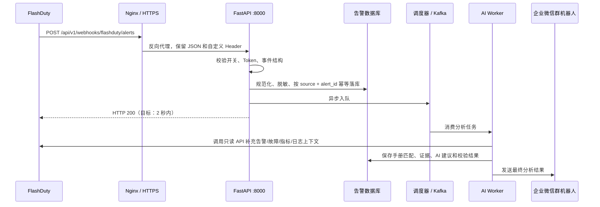

# FlashDuty 告警 Webhook 接收与后续分析

本文详细说明 `POST /api/v1/webhooks/flashduty/alerts` 如何接收 FlashDuty 告警，以及告警进入本服务后如何完成鉴权、规范化、去重、持久化、异步 AI 分析、结果查询和企微通知。内容以当前项目代码为准。

## 先明确两个不同的 Webhook

本项目中有两个方向完全相反的 Webhook，不能混用：

| 配置 | 方向 | 用途 |
| --- | --- | --- |
| `https://<服务域名>/api/v1/webhooks/flashduty/alerts` | FlashDuty → 本服务 | 接收告警，是本文说明的入口 |
| `WECOM_WEBHOOK_URL=https://qyapi.weixin.qq.com/cgi-bin/webhook/send?key=...` | 本服务 → 企业微信群 | 分析完成后发送结果 |

企业微信群机器人地址只能接收本服务发出的消息，不能被本服务用来读取群消息，也不能填入 FlashDuty 的告警 Webhook Endpoint。

## 整体链路



Webhook 请求线程只完成必要的接收工作，不等待手册检索、FlashDuty 上下文查询和 AI 推理。FlashDuty 官方要求目标服务在 2 秒内返回 HTTP 200；超时和部分网络错误可能触发重试，因此接收端必须支持幂等。

## 一、接收前准备

### 1. 配置环境变量

复制模板：

```bash
cp .env.example .env
```

至少配置以下内容：

```dotenv
# FlashDuty 总开关。Webhook 和轮询都依赖此开关。
FLASHDUTY_ENABLED=true

# 告警 Webhook 接收开关。
FLASHDUTY_WEBHOOK_ENABLED=true

# 与 FlashDuty 自定义 Header 中的值保持一致。
# 生产环境必须设置为足够长的随机值，不要提交到 Git。
FLASHDUTY_WEBHOOK_TOKEN=replace-with-a-long-random-value

# 只读 Open API，用于补偿轮询和 AI 调查上下文。
FLASHDUTY_BASE_URL=https://api.flashcat.cloud
FLASHDUTY_APP_KEY=replace-with-read-only-app-key
FLASHDUTY_TIMEOUT_SECONDS=40
FLASHDUTY_MAX_RETRIES=2

# 每 5 分钟轮询一次，回看 15 分钟，补偿 Webhook 漏送或短时中断。
FLASHDUTY_POLLING_ENABLED=true
FLASHDUTY_POLL_INTERVAL_SECONDS=300
FLASHDUTY_POLL_LOOKBACK_SECONDS=900
FLASHDUTY_POLL_CHANNEL_IDS=[123456789]
FLASHDUTY_POLL_INTEGRATION_IDS=[]

# AI 与分析结果出站通知。
AI_PROVIDER=openai_compatible
AI_API_KEY=replace-me
AI_MODEL=replace-me
AI_TIMEOUT_SECONDS=60
AI_FALLBACK_ENABLED=true
WECOM_WEBHOOK_URL=https://qyapi.weixin.qq.com/cgi-bin/webhook/send?key=replace-me
```

可用下面的命令生成 Webhook Token：

```bash
openssl rand -hex 32
```

`FLASHDUTY_WEBHOOK_TOKEN` 是 FlashDuty 与本服务之间的共享秘密。当前协议使用自定义 Header 鉴权，不是请求体签名。服务端使用常量时间比较，降低 Token 比较的时序泄露风险。开发环境允许留空，但此时接口不会校验 Header；生产环境的就绪检查会把空 Token 报告为配置错误。

### 2. 启动并检查 8000 端口

本地直接运行：

```bash
alembic upgrade head
uvicorn app.api.main:app --host 0.0.0.0 --port 8000
```

或使用 Docker Compose：

```bash
docker compose up -d --build
```

当前 `docker-compose.yml` 将 API 绑定为 `127.0.0.1:8000:8000`。这意味着外网不能绕过 Nginx 直接访问 FastAPI，Nginx 可以在同一台主机上通过 `127.0.0.1:8000` 反代。

检查服务：

```bash
curl -i http://127.0.0.1:8000/health/live
curl -i http://127.0.0.1:8000/health/ready
```

- `/health/live` 返回 200 表示进程存活；
- `/health/ready` 返回 200 且 `status=ready` 表示数据库和必要配置通过检查；
- 如果 ready 返回 503，应先处理 `issues`，不要立即配置 FlashDuty 回调。

## 二、使用 Nginx 提供公网 HTTPS 地址

FlashDuty 必须能够从公网访问 Endpoint。推荐让 FastAPI 继续只监听本机 8000 端口，由 Nginx 暴露 443，并且只公开精确的 Webhook 路径。

### 1. 基础条件

部署前确认：

1. 域名 A/AAAA 记录已经指向服务器公网 IP；
2. 云安全组和系统防火墙允许公网访问 TCP 80、443；
3. FastAPI 在服务器本机的 `127.0.0.1:8000` 可访问；
4. 域名已经通过 ACME/Certbot 等方式取得受信任证书；
5. 不要把 8000 端口直接开放给公网。

### 2. Nginx 配置示例

将以下内容按实际域名和证书路径调整后放入 Nginx 的站点配置。不同发行版可能使用 `/etc/nginx/conf.d/` 或 `/etc/nginx/sites-available/`。

```nginx
server {
    listen 80;
    listen [::]:80;
    server_name alerts.example.com;

    return 301 https://$host$request_uri;
}

server {
    listen 443 ssl http2;
    listen [::]:443 ssl http2;
    server_name alerts.example.com;

    ssl_certificate     /etc/letsencrypt/live/alerts.example.com/fullchain.pem;
    ssl_certificate_key /etc/letsencrypt/live/alerts.example.com/privkey.pem;
    ssl_protocols TLSv1.2 TLSv1.3;

    # 只向公网暴露 FlashDuty 告警入口，避免顺带暴露其他未认证 API。
    location = /api/v1/webhooks/flashduty/alerts {
        limit_except POST {
            deny all;
        }

        client_max_body_size 1m;

        proxy_pass http://127.0.0.1:8000;
        proxy_http_version 1.1;
        proxy_set_header Host $host;
        proxy_set_header X-Real-IP $remote_addr;
        proxy_set_header X-Forwarded-For $proxy_add_x_forwarded_for;
        proxy_set_header X-Forwarded-Proto $scheme;

        # FlashDuty 以 2 秒为响应成功窗口；应用层必须快速完成接收。
        proxy_connect_timeout 1s;
        proxy_send_timeout 2s;
        proxy_read_timeout 2s;
    }

    # 其他路径默认不对公网开放。
    location / {
        return 404;
    }
}
```

加载配置前先检查语法：

```bash
sudo nginx -t
sudo systemctl reload nginx
```

如果服务器上已经有统一网关，只需把精确 `location` 合并到现有 HTTPS `server`，不要重复创建冲突的 `server_name`。反代时不需要在 Nginx 中硬编码 `X-FlashDuty-Token`；该 Header 应由 FlashDuty 发出并原样传给 FastAPI。

### 3. 从公网验证

先确认 TLS 和路由：

```bash
curl -i https://alerts.example.com/api/v1/webhooks/flashduty/alerts
```

因为该接口只允许 POST，GET 得到 403、404 或 405 均可说明请求已经到达网关；最终联调必须使用下文的 POST 示例。证书域名不匹配、证书链不完整或使用自签名证书，都会导致 FlashDuty 在开启 TLS 验证时调用失败。

## 三、在 FlashDuty 配置告警 Webhook

根据 FlashDuty 官方文档，进入“集成中心 → Webhook”，添加或编辑“告警 Webhook”：

1. **Endpoint**：填写 `https://alerts.example.com/api/v1/webhooks/flashduty/alerts`；
2. **TLS 验证**：生产环境保持开启；
3. **Headers**：添加 `X-FlashDuty-Token: <FLASHDUTY_WEBHOOK_TOKEN>`；
4. **协作空间**：选择全部空间或指定空间；生产环境建议只选本项目负责的空间；
5. **事件类型**：订阅 `a_new`、`a_update`、`a_merge`；`a_close` 是系统产生的手动关闭事件，当前服务只确认接收，不启动新分析；
6. 保存后使用 FlashDuty 的测试能力发送告警，并在“调用历史”查看 Request、Response、HTTP 状态和耗时。

FlashDuty 当前定义的事件类型：

| `event_type` | 含义 | 当前服务行为 |
| --- | --- | --- |
| `a_new` | 新事件触发新告警 | 接收、去重并入队分析 |
| `a_update` | 新事件合并到已有告警并更新信息 | 接收；按 FlashDuty `alert_id` 幂等处理 |
| `a_merge` | 告警被合并进故障 | 接收，并在分析阶段读取关联故障上下文 |
| `a_close` | 告警被手动关闭 | HTTP 200 确认，但 `accepted=false`，不创建新分析任务 |

## 四、请求协议

### 1. 请求头

```http
POST /api/v1/webhooks/flashduty/alerts HTTP/1.1
Host: alerts.example.com
Content-Type: application/json
X-FlashDuty-Token: <与 .env 一致的 Token>
```

### 2. 顶层字段

| 字段 | 必填 | 当前校验 |
| --- | --- | --- |
| `event_id` | 是 | 非空字符串，最长 255；同一次投递重试会复用该值 |
| `event_time` | 是 | 大于等于 0 的整数；FlashDuty 官方定义为毫秒时间戳 |
| `event_type` | 是 | 只能是 `a_new`、`a_update`、`a_merge`、`a_close` |
| `alert` | 是 | JSON 对象，包含最新完整告警信息 |
| `person` | 否 | 人工操作人信息；模型允许保留该扩展字段 |

Webhook 顶层允许 FlashDuty 将来增加额外字段，未知字段不会导致请求直接失败。

### 3. 当前分析所需的关键告警字段

FlashDuty 官方 Payload 比下面更完整；以下是当前规范化逻辑真正依赖的关键字段：

| 字段 | 要求 | 用途 |
| --- | --- | --- |
| `alert.alert_id` | 24 位十六进制 ObjectID | 作为上游稳定身份和幂等键 |
| `alert.title` | 非空 | 告警标题和手册检索输入 |
| `alert.alert_severity` / `alert.alert_status` | `Critical`、`Warning`、`Info` 或 `Ok` | 映射为本地三等级；`Ok` 映射为 `INFO` 并保留原状态 |
| `alert.start_time` / `alert.event_time` | Unix 秒时间戳 | 告警发生时间 |
| `alert.labels` | 字符串 KV 对象，可选 | 提取环境、服务、数据库、指标和告警类型 |
| `alert.incident.incident_id` | 存在时须为 24 位 ObjectID | 查询关联故障、时间线和相似历史故障 |

建议在上游 labels 中提供：

```json
{
  "environment": "production",
  "service": "orders-db",
  "database_engine": "mysql",
  "instance": "orders-mysql-01",
  "database": "orders",
  "metric_name": "mysql_global_status_threads_connected",
  "alertname": "MySQLConnectionsHigh",
  "cluster": "prod-db"
}
```

字段越完整，手册匹配、FlashDuty 只读工具选择和 AI 根因判断越准确。缺少数据库标签不会阻止接收，但会减少可执行的数据库专项调查。

### 4. 可直接联调的请求示例

下面是“当前接口可接受的最小完整示例”，不是对 FlashDuty 官方完整 Payload 的替代：

```bash
curl -i -X POST \
  'https://alerts.example.com/api/v1/webhooks/flashduty/alerts' \
  -H 'Content-Type: application/json' \
  -H 'X-FlashDuty-Token: replace-with-the-same-token' \
  -d '{
    "event_id": "webhook-event-001",
    "event_time": 1712650300000,
    "event_type": "a_new",
    "alert": {
      "alert_id": "663a1b2c3d4e5f6789abcdef",
      "title": "MySQL connections are too high",
      "description": "Threads connected exceeded the warning threshold",
      "alert_key": "mysql-connections-high",
      "alert_severity": "Warning",
      "alert_status": "Warning",
      "progress": "Triggered",
      "start_time": 1712650000,
      "last_time": 1712650290,
      "data_source_id": 42,
      "data_source_name": "FlashDuty Monitors",
      "data_source_type": "monit.alert",
      "channel_id": 7,
      "channel_name": "Database",
      "labels": {
        "environment": "production",
        "service": "orders-db",
        "database_engine": "mysql",
        "instance": "orders-mysql-01",
        "database": "orders",
        "alertname": "MySQLConnectionsHigh"
      }
    }
  }'
```

首次接收的典型响应：

```http
HTTP/1.1 200 OK
Content-Type: application/json

{
  "event_id": "webhook-event-001",
  "event_type": "a_new",
  "accepted": true,
  "alert_id": "5a62b760-6f23-4a83-a3b4-c38e12031234",
  "status": "QUEUED",
  "deduplicated": false,
  "message": "FlashDuty alert accepted for asynchronous analysis."
}
```

响应中的 `alert_id` 是本服务生成的 UUID，不是 FlashDuty 的 24 位告警 ObjectID。后续应使用该 UUID 查询本地分析详情。

同一 FlashDuty `alert_id` 再次投递时，典型响应仍是 HTTP 200，但 `deduplicated=true`。这能避免 FlashDuty 重试造成重复任务。

## 五、接口收到请求后执行什么

### 步骤 1：FastAPI 解析基础结构

`FlashDutyAlertWebhookEvent` 首先检查顶层必填字段、事件类型和基本数据类型。缺字段、`event_type` 不在枚举内或 `alert` 不是对象时，FastAPI 返回 422。

### 步骤 2：检查接入开关

只有同时满足以下配置才接收：

```text
FLASHDUTY_ENABLED=true
FLASHDUTY_WEBHOOK_ENABLED=true
```

否则返回 503，错误码为 `FLASHDUTY_WEBHOOK_DISABLED`。

### 步骤 3：校验共享 Token

如果 `.env` 配置了 `FLASHDUTY_WEBHOOK_TOKEN`，请求必须包含完全相同的 `X-FlashDuty-Token`。缺失或错误时返回 401，错误码为 `INVALID_FLASHDUTY_WEBHOOK_TOKEN`。

Token 只应存在于部署环境和 FlashDuty Webhook Header 配置中：

- 不要放在 URL Query 中；
- 不要写入 README、提交记录或前端代码；
- 不要在 Nginx access log 格式中记录该 Header；
- 怀疑泄露时同时更新 `.env` 和 FlashDuty Header，然后重启服务。

### 步骤 4：处理关闭事件

当 `event_type=a_close` 时，接口立即返回 HTTP 200：

```json
{
  "event_id": "...",
  "event_type": "a_close",
  "accepted": false,
  "alert_id": null,
  "status": null,
  "deduplicated": false,
  "message": "Close event acknowledged; no new analysis was scheduled."
}
```

当前版本不会因为手动关闭告警而再次运行根因分析。

### 步骤 5：规范化 FlashDuty 告警

`FlashDutyAlertSourceAdapter` 将官方 Payload 映射为统一的 `NormalizedAlert`：

| 本地字段 | FlashDuty 来源或规则 |
| --- | --- |
| `external_id` | `alert.alert_id` |
| `severity` | `alert_severity` → `alert_status` → `event_severity` → `event_status` |
| `environment` | `labels.environment` 或 `labels.env`，再按环境别名归一化 |
| `service_name` | `labels.service`、`app`、`application` 或 `resource` |
| `alert_type` / `reason` | `labels.check`、`alertname`、`reason`、`alert_key` 或标题 |
| 数据库目标 | 从 `database_engine/db_type/engine`、`instance/resource/host`、`database/db` 提取 |
| `incident_id` | `alert.incident.incident_id` 或顶层 `incident_id` |
| `occurred_at` | `start_time` 或 `event_time` |
| 原始事件信息 | 保存首个 `event_id`、`event_type` 及脱敏后的原始 Payload |

严重程度统一为 `CRITICAL`、`WARNING`、`INFO`。FlashDuty 的恢复状态 `Ok` 在本地优先级上按 `INFO` 处理，但原始等级和状态仍保留在证据中。

### 步骤 6：脱敏并持久化

规范化后先经过统一脱敏，再写数据库。幂等身份是：

```text
source = "flashduty"
external_id = FlashDuty alert.alert_id
```

数据库对该身份执行 `create_or_get`：

- 首次出现：创建本地告警，状态从 `RECEIVED` 更新为 `QUEUED`；
- 已存在：返回原有告警，`deduplicated=true`；
- 并发重复请求：依赖数据库唯一性约束收敛为同一条记录。

这里按 `alert_id` 而不是仅按 `event_id` 去重。这样既能消除同一事件的重试，也能避免同一 FlashDuty 告警的更新事件反复创建独立根因分析。

### 步骤 7：异步入队

满足以下任一条件时，接口将本地告警 UUID 交给调度器：

- 告警是首次创建；
- 已有告警仍为 `QUEUED`；
- 已有告警为 `FAILED`，允许重新尝试。

调度方式由 `HTTP_SCHEDULER` 决定：

| 模式 | 使用场景 | 特点 |
| --- | --- | --- |
| `in_memory` | 本地开发或单进程验证 | API 进程内队列；启动时会重新发现数据库中的 `QUEUED/ANALYZING` 告警 |
| `kafka` | Docker Compose / 生产建议 | API 只投递任务，独立 Worker 消费，进程职责分离 |
| `manual` | 自动化测试 | 只记录任务，不会自行运行分析 |

### 步骤 8：返回 HTTP 200

入库和入队成功后立即向 FlashDuty 返回 200。AI 分析失败与否不影响这次 Webhook 的接收响应，因为分析发生在后续异步任务中。

## 六、异步 AI 分析流程

Worker 获取任务后按以下阶段执行，进度会持续写入数据库：

1. `RECEIVED`：Worker 取得分析租约，避免多个 Worker 同时分析同一告警；
2. `FINGERPRINTING`：使用环境、服务、数据库类型、告警类型和归一化错误模式生成问题指纹；
3. `KNOWLEDGE_MATCHING`：查找已由人工确认的历史案例；
4. `RUNBOOK_MATCHING`：检索本地 PDF 手册的章节、结构化索引和视觉证据；
5. `INVESTIGATING`：按调查策略调用只读工具，补充 FlashDuty 实时上下文；
6. `ADVISING`：AI 以手册为首要依据、实时证据为辅助生成结构化原因和核查建议；
7. `VALIDATING`：执行规则校验和独立结论校验；
8. `REPORTING`：先保存建议、证据、状态和审计记录，再尝试发送企微消息；
9. 终态：`COMPLETED`、`REVIEW_REQUIRED` 或 `FAILED`。

调查阶段会在可用时读取以下 FlashDuty 只读上下文：

- `/alert/info`：最新告警详情；
- `/alert/event/list`：原始事件；
- `/alert/feed`：告警动态；
- `/incident/info`、`/incident/alert/list`、`/incident/feed`：关联故障详情、关联告警和时间线；
- `/incident/past/list`：历史相似故障；
- `/change/list`：告警时间窗内的变更；
- `/monit/query/diagnose`、`/monit/query/rows`：指标、日志和只读行查询；
- `/monit/targets`、`/monit/tools/catalog`、`/monit/tools/invoke`：数据库监控对象和受限只读诊断工具。

客户端采用显式只读白名单。FlashDuty 的部分查询接口虽然使用 HTTP POST，但语义仍然是查询；本项目不会因此开放创建、修改、删除、认领或恢复操作。SQL 类调查只允许单条 `SELECT`、`SHOW`、`DESCRIBE` 或 `EXPLAIN`。

### AI 超时或返回结构错误

当 `AI_FALLBACK_ENABLED=true` 时，主模型超时、网关不支持结构化输出或多次返回不符合 Schema 的结果，会触发保守降级建议。流程继续经过 `VALIDATING → REPORTING`，最终进入 `REVIEW_REQUIRED`，而不是直接在 `ADVISING` 后跳到 `FAILED`。

数据库异常、持久化错误等无法安全继续的系统错误仍进入 `FAILED`。调查工具的辅助接口部分失败时会保留已获取证据并继续；必需工具失败会使校验不通过并进入人工复核。

### 企微通知失败

分析结果先持久化，再发送到 `WECOM_WEBHOOK_URL`。企微发送失败只记录警告，不会把已经完成的分析改写为 `FAILED`。当前项目不负责企微送达确认、通知重试和升级分派。

## 七、5 分钟轮询补偿为什么仍然需要

Webhook 是实时主链路，但不能假设绝不丢失。FlashDuty 官方说明部分网络错误最多重试一次，而且重试可能造成乱序。因此服务同时运行 `/alert/list` 轮询器作为补偿链路。

当前轮询逻辑：

1. API 启动后立即执行第一轮，此后按 `FLASHDUTY_POLL_INTERVAL_SECONDS` 周期执行；
2. 首轮查询“当前时间减去 lookback”到当前时间的活跃告警；
3. 按 `updated_at` 升序、`by_updated_at=true`、游标分页查询 `/alert/list`；
4. 对每条告警优先调用 `/alert/info` 获取最新完整详情；
5. `/alert/info` 暂时失败时，使用 `/alert/list` 返回的完整 AlertItem 继续入站；
6. 与 Webhook 共用 `source + alert_id` 幂等逻辑，不会重复创建告警；
7. 只有整轮成功才推进内存水位；失败时保留旧水位，下轮重扫重叠窗口；
8. 单轮最多 100 页，防止异常分页无限循环。

配置建议：

- `FLASHDUTY_POLL_INTERVAL_SECONDS` 不能小于 300，默认正好 5 分钟；
- `FLASHDUTY_POLL_LOOKBACK_SECONDS=900` 让相邻轮次重叠 15 分钟，可覆盖延迟、重试、短时中断和进程重启；
- 生产环境应填写 `FLASHDUTY_POLL_CHANNEL_IDS`，减少读取无关协作空间；
- 空的 `CHANNEL_IDS` 和 `INTEGRATION_IDS` 表示不按该维度过滤，可能读取 APP Key 有权限看到的全部活跃告警；
- 轮询需要 `FLASHDUTY_APP_KEY`，Webhook Token 不能代替 Open API APP Key。

## 八、查看接收与分析结果

### 1. 查询单条告警

使用 Webhook 响应中的本地 UUID：

```bash
curl -sS 'http://127.0.0.1:8000/api/v1/alerts/<本地-alert_id>'
```

关注：

- `status`：`QUEUED`、`ANALYZING`、`COMPLETED`、`REVIEW_REQUIRED` 或 `FAILED`；
- `latest_run.current_stage`：当前分析阶段；
- `progress`：阶段历史与失败类型；
- `evidence`：FlashDuty 只读查询和其他调查证据；
- `recommendation`：原因、置信度、人工复核要求和核查步骤；
- `error`：终态为 `FAILED` 时的脱敏错误。

运维查询接口不应随 Webhook 一起直接暴露到公网；应通过内网、VPN 或带认证的统一网关访问。

### 2. 查看服务日志

Docker Compose：

```bash
docker compose logs --since=30m api
docker compose logs --since=30m worker
```

重点日志关键词：

```text
flashduty_poll_completed
flashduty_poll_failed
flashduty_poll_alert_info_failed_using_list_item
flashduty_poll_alert_ingest_failed
Asynchronous investigation failed
wecom_analysis_result_send_failed
```

### 3. 查看 FlashDuty 调用历史

在 FlashDuty 告警 Webhook 集成详情的“调用历史”中，可以按时间、告警 ID、事件类型和请求状态筛选。调用详情会显示：

- 实际 Endpoint、Request Headers 和 Request Payload；
- HTTP 状态码、Response Body 和耗时；
- 首次请求与重试次数；
- `event_id` 和关联的 FlashDuty `alert_id`。

排障时先确认 FlashDuty 是否真正发出了请求，再确认 Nginx 是否收到，最后查看 API 和 Worker 日志。

## 九、常见响应与故障定位

| HTTP 状态 | 典型原因 | 处理方法 |
| --- | --- | --- |
| 200 | 首次接收、重复接收或 `a_close` 已确认 | 查看 JSON 中的 `accepted`、`deduplicated` 和 `status` |
| 401 | Token 缺失或不一致 | 同步 `.env` 与 FlashDuty 自定义 Header，重启 API |
| 404 | Nginx 域名或精确路径不匹配 | 检查 Endpoint 必须以 `/api/v1/webhooks/flashduty/alerts` 结尾 |
| 405 | 使用了 GET 或 Nginx 只允许 POST | 使用 POST，确认 FlashDuty 集成类型是告警 Webhook |
| 413 | 请求体超过 Nginx 限制 | 检查是否出现异常超大 Payload，再谨慎调整 `client_max_body_size` |
| 422 | 顶层字段缺失、事件类型错误、告警 ID/等级/时间不合法 | 对照 FlashDuty 调用历史中的 Request Payload 和本文字段表 |
| 502 | Nginx 无法连接本机 8000 | 检查 API 容器/进程、端口绑定和 Nginx upstream |
| 503 | FlashDuty 或 Webhook 开关关闭，或网关上游不可用 | 检查 `.env`、`/health/ready` 和 API 日志 |
| 504 / 超时 | 接收过程超过 2 秒、数据库或 Kafka 阻塞 | 检查数据库、Kafka producer、API 资源和网络；AI 不应在请求线程运行 |

### 收到 200 但没有分析结果

按顺序检查：

1. 响应是否 `accepted=false`；若是 `a_close`，这是当前预期行为；
2. 响应是否 `deduplicated=true`；使用返回的本地 UUID 查询原任务；
3. 状态是否一直为 `QUEUED`；检查调度器是否启动，Kafka 模式下检查 Worker；
4. 状态是否为 `ANALYZING`；查看 `latest_run.current_stage` 和租约是否过期；
5. 状态是否为 `REVIEW_REQUIRED`；这不是链路失败，表示校验、影子模式或 AI 降级要求人工复核；
6. 状态是否为 `FAILED`；查看 `error` 和最后一条 `progress`，优先排查数据库、手册文件、AI 配置和必需调查工具。

### FlashDuty 显示推送失败，但 API 中已有告警

可能是请求已成功入库，但响应在网络中丢失或超过 FlashDuty 的 2 秒窗口。FlashDuty 会使用同一 `event_id` 重试，本服务按 `alert_id` 幂等返回已有任务。此时不要人工复制创建另一条告警。

## 十、安全和生产检查清单

上线前逐项确认：

- [ ] 域名证书由受信任 CA 签发，证书链完整，TLS 验证保持开启；
- [ ] 8000 只绑定 `127.0.0.1` 或私网，不对公网开放；
- [ ] Nginx 只公开精确 Webhook 路径，其他 API 通过内网或认证网关访问；
- [ ] 使用至少 32 字节随机 `FLASHDUTY_WEBHOOK_TOKEN`，且未进入 Git、前端或日志；
- [ ] FlashDuty Header 名精确为 `X-FlashDuty-Token`；
- [ ] `FLASHDUTY_APP_KEY` 使用独立、最小权限的只读凭证；
- [ ] 轮询限制到目标协作空间或集成；
- [ ] 数据库已执行迁移，并有备份和容量监控；
- [ ] 生产使用 Kafka 或等价的可靠任务队列，并监控 API、Broker 和 Worker；
- [ ] `/health/ready` 返回 ready；
- [ ] 用真实 FlashDuty 测试告警验证 2 秒内 HTTP 200；
- [ ] 验证首次请求 `deduplicated=false`、重复请求 `deduplicated=true`；
- [ ] 验证分析能到达 `COMPLETED` 或 `REVIEW_REQUIRED`，并能在企微看到结果；
- [ ] 确认 Nginx 和应用日志不会输出 Token、APP Key、AI Key 或企微 URL；
- [ ] 配置日志轮转、告警和时间同步。

## 十一、当前幂等语义和后续演进

当前实现以 FlashDuty `alert_id` 作为一条本地告警的稳定身份。因此：

- 同一 `event_id` 的重试不会生成重复任务；
- 同一告警的 `a_update`、`a_merge` 也不会生成第二条本地告警；
- 首次保存的脱敏原始事件会保留首个 `event_id/event_type`；
- 已经进入 `COMPLETED` 或 `REVIEW_REQUIRED` 的告警收到后续更新时，不会自动重跑完整分析；
- `a_close` 当前只确认，不保存为新的生命周期事件。

这是“避免告警风暴重复分析”优先的设计。如果后续需要完整保存生命周期并在严重程度升级时重跑，建议在不破坏现有告警主键的前提下增加独立的事件表，以 `event_id` 幂等保存每次投递，并基于 `event_time` 处理乱序；再定义明确的重分析规则，例如只在 `Warning → Critical`、关联故障变化或关键 labels 变化时创建新的分析 Run。

## 参考资料

- [FlashDuty 告警 Webhook 官方文档](https://docs.flashduty.com/zh/on-call/integration/webhooks/alert-webhook)
- [FlashDuty Open API 文档](https://docs.flashduty.com/zh/openapi)
- 项目根目录 [README](../../README.md)
- 环境变量模板 [`.env.example`](../../.env.example)
