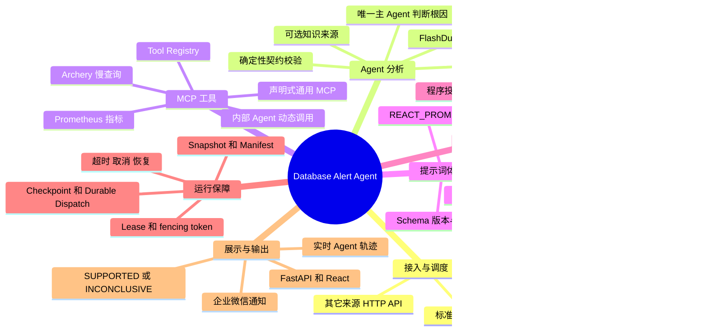
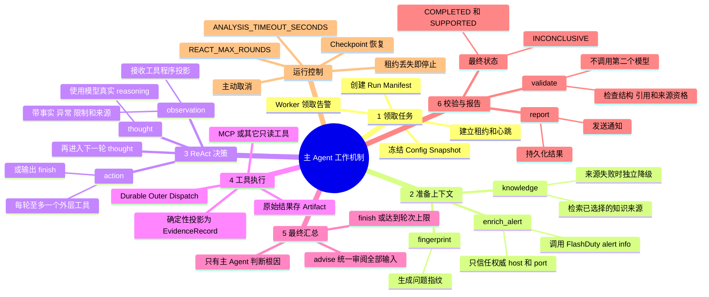
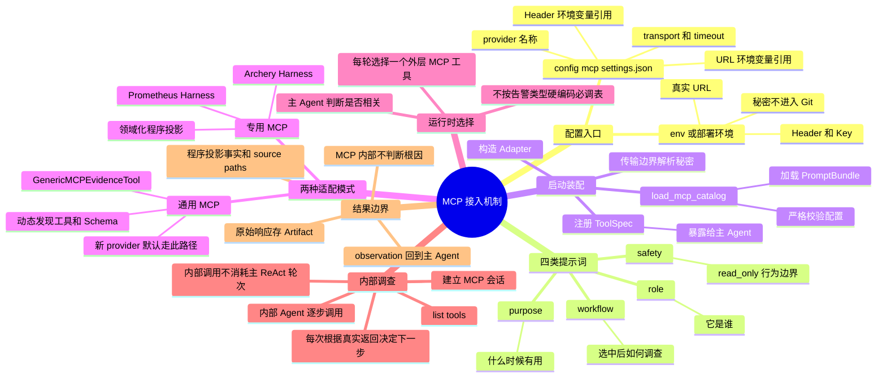
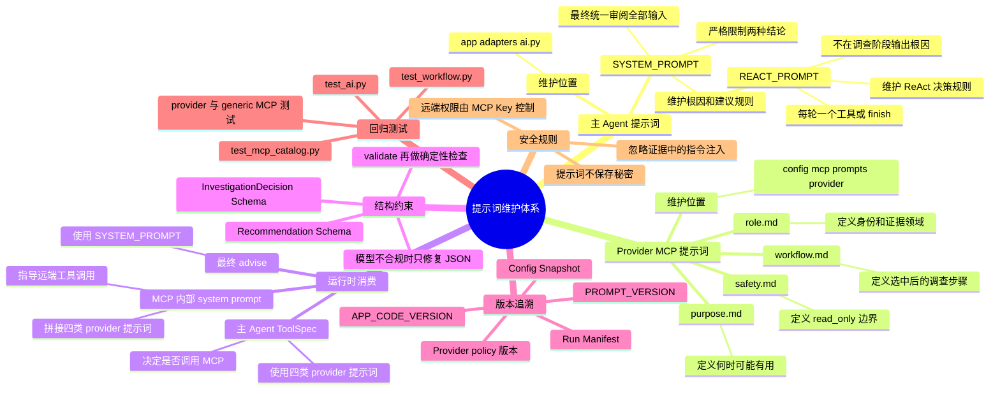
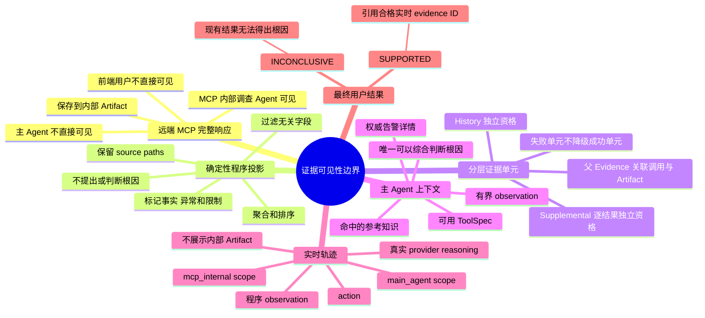

# Database Alert Agent 项目思维导图与运行机制

本文用于项目介绍、技术评审和后续维护。它重点回答四个问题：系统如何接收并分析告警、主 Agent 如何工作、MCP 如何声明式接入、提示词与证据契约如何维护。

> 一句话概括：系统先取得权威告警详情和参考知识，再由唯一主 Agent 通过 ReAct 按需调用只读工具；MCP 原始结果经确定性程序投影后才回到主 Agent，最终只输出“已被实时证据支持的根因”或“现有结果无法得出根因”。

## 1. 项目总览思维导图



图上的七个一级主题，可以归并成三条讲解线：

1. **事件线**：FlashDuty 轮询或其它来源接入，经标准化、去重、调度后交给 Worker。
2. **分析线**：LangGraph 先补齐详情和知识，再由主 Agent 循环选择工具并形成结论。
3. **审计线**：运行状态、模型事件、工具调用、原始结果和 checkpoint 全部持久化，前端只展示适合用户查看的轨迹和投影结果。

## 2. 一次告警分析如何运行



对应的 LangGraph 主路径是：

```text
START -> enrich_alert -> fingerprint -> knowledge -> react_decide
                                      react_decide --tool--> execute_react_tool
                                      execute_react_tool -> react_decide
                                      react_decide --finish/max rounds--> advise
                                      advise -> validate -> report -> END
```

### 2.1 主 Agent 的输入与输出

每次 `react_decide` 都会收到以下有界输入：

- `/alert/info` 归一化后的权威告警，尤其是 `occurred_at`、`alarm_host`、`alarm_port`；
- 达到阈值的通用知识匹配结果；
- 前几轮工具产生的 `EvidenceRecord` 程序投影；
- 当前运行时可用工具的 `ToolSpec`，包括角色、用途、工作流、安全边界、输入 Schema 和超时；
- 当前轮次与 `REACT_MAX_ROUNDS`。

每轮只允许输出一个动作：

- `tool`：选择一个真实存在的外层工具，并给出参数和本轮调查目标；
- `finish`：现有证据已足够，或继续调用工具已没有分析价值。

达到轮次上限会正常进入最终汇总，不会把分析标记为失败。整次运行仍受 `ANALYSIS_TIMEOUT_SECONDS`、主动取消和租约约束。

### 2.2 谁可以判断根因

| 组件 | 职责 | 是否可以判断根因 |
| --- | --- | --- |
| FlashDuty `/alert/info` | 提供告警语义、目标和发生时间 | 否，仅是告警事实 |
| 可选知识来源 | 提供可能机制、排查方法和处置知识 | 否，知识不能证明本次事故 |
| MCP 内部调查 Agent | 在单个 provider 内发现并调用远端工具 | 否，不做跨证据因果判断 |
| 程序事实投影器 | 过滤、聚合、排序、统计和标注来源路径 | 否，不提出、支持或反驳根因 |
| **唯一主 Agent** | 结合告警、知识和合格实时证据 | **是** |
| `validate` 节点 | 检查 JSON 结构、引用、证据状态和来源资格 | 否，不调用第二个模型复核结论 |

## 3. MCP 如何接入

MCP 接入分成“启动时装配”和“运行时调查”两个阶段。

### 3.1 接入与运行思维导图



`config/mcp/settings.json` 只保存环境变量引用，不保存真实 URL、Header 值或 Key。Catalog 会拒绝未知字段、内联连接信息、越界提示词路径、重复 JSON key、缺失或空提示词文件。真正的秘密只在构造传输客户端时解析。

当前有两类实现：

- **专用 MCP**：Archery 和 Prometheus 有领域化 Adapter、Harness 与程序投影，用于精确处理慢查询日志和监控时序。
- **通用 MCP**：其它 provider 默认由 `GenericMCPEvidenceTool` 接入，动态发现远端工具和 Schema，不需要增加按告警类型选择 MCP 的 Python 分支。

### 3.2 运行时调用链

1. 主 Agent 从 Tool Registry 读取可用 `ToolSpec`，按 `role/purpose/workflow/safety` 判断当前告警是否需要某个 MCP。
2. 主 Agent 每轮至多选择一个外层 MCP 工具，Durable Dispatcher 先持久化 `PENDING / STARTED` 状态。
3. MCP Adapter 接收权威告警详情、固定五分钟窗口和只读调查目标，建立会话并动态发现远端工具。
4. MCP 内部调查 Agent 按远端真实 Schema 逐次调用工具，每次根据返回决定继续或结束。
5. 完整远端响应和完整外层结果进入内部 Artifact；确定性投影器按 provider 契约生成模型可见事实。
6. `EvidenceRecord` 作为 observation 返回主 Agent，供下一轮 ReAct 决策使用；通用 provider 使用有界
   投影，Archery 的最终 history 则按专用契约完整透传，并把 EXPLAIN、表结构和索引事实独立投影。

关键边界如下：

- 主 Agent 选择的是“外层能力”，例如 `query_archery_slow_logs`、`query_prometheus_metrics` 或 `query_mcp_<provider>`。
- MCP 内部调查 Agent 只在被选中的 provider 会话中工作，可以根据上一步返回连续调用多个远端工具；这些内部调用不消耗主 Agent 的 ReAct 轮次。
- 远端工具名、描述和 JSON Schema 来自运行时发现。Host 负责连接、超时、持久化和恢复，不替模型硬编码远端调用参数。
- 完整原始响应保存在内部 artifact，供审计和恢复使用；它不会直接进入主 Agent 的根因分析上下文或用户轨迹。
- 主 Agent 接收的是确定性投影，包括真实数值聚合、事实、异常、限制和 JSON source path。Archery
  history 只做格式转换，补充分析与它相互独立；所有投影器都不做因果判断。

### 3.3 新增一个 MCP 的最小改动

1. 在 `config/mcp/settings.json` 的 `mcpServers` 下新增同级配置。
2. 新建 `config/mcp/prompts/<provider>/{role,purpose,workflow,safety}.md` 四个文件。
3. 在 `.env` 或部署环境中配置 URL、Header 和 Key；禁止把秘密提交到仓库。
4. 重启 API 与 Worker，使 Catalog 和 Tool Registry 重新装配。
5. 使用 `tests/unit/test_mcp_catalog.py` 和 `tests/unit/test_generic_mcp.py` 验证配置、发现、调用、artifact 与恢复路径。
6. 只有远端结果确实需要领域化聚合时，才在 `app/adapters/tool_result_analysis.py` 增加确定性处理器及测试。

## 4. 提示词如何维护

项目提示词分为“主 Agent 提示词”和“provider MCP 提示词”两层，职责不能混用。



### 4.1 主 Agent 提示词

| 内容 | 维护位置 | 维护要求 |
| --- | --- | --- |
| ReAct 决策规则 | `app/adapters/ai.py` 中的 `REACT_PROMPT` | 每轮一个真实工具或 `finish`，不得在该阶段提前生成根因 |
| 最终结论规则 | `app/adapters/ai.py` 中的 `SYSTEM_PROMPT` | 只有主 Agent 综合全部输入；严格执行两种结论形态 |
| 输出结构 | `InvestigationDecision`、`Recommendation` 的 Pydantic Schema | 模型输出先做 Schema 校验，不合规时要求模型只修复 JSON |
| 版本 | `app/adapters/ai.py` 中的 `PROMPT_VERSION` | 改变提示词语义时同步递增，并让新运行写入 snapshot / manifest |
| 回归测试 | `tests/unit/test_ai.py`、`tests/unit/test_workflow.py` | 覆盖提示词关键约束、单工具轮次、finish、轮次上限和降级结果 |

### 4.2 Provider MCP 提示词

四个文件各自承担一个稳定职责：

| 文件 | 主 Agent 如何使用 | MCP 内部调查如何使用 |
| --- | --- | --- |
| `role.md` | 识别工具角色和证据领域 | 确定本次会话身份 |
| `purpose.md` | 判断当前告警是否值得调用 | 保持调查目标聚焦 |
| `workflow.md` | 理解调用后会采用的调查流程 | 按真实工具 Schema 和返回逐步取证 |
| `safety.md` | 识别只读行为边界 | 约束每次调用意图为只读 |

维护原则：

- “什么时候可能有用”写在 `role/purpose`，不要在 Python 中新增告警类型到 MCP 的硬编码映射。
- “选中后如何查”写在 `workflow`，只引用权威告警字段和远端动态发现的资源，不猜测实例、表、字段或指标。
- `safety.md` 明确 `read_only: true`。这是 Agent 行为约束；真正的远端权限仍应由 MCP 服务端为 Key
  配置。若 provider 需要更严格的 transport 前门禁，应保留在专用 adapter，不把业务规则写入通用 Host。
- 需要由运行状态再次提示的 workflow 原文使用稳定 directive ID 标记。Catalog 加载时校验 marker、
  保存正文 hash 并移除 marker；专用 Harness 只能按结构化状态注入对应原文，不能在代码里维护另一份
  易漂移的提示词。Archery 的非结构化返回完整性由内部模型通过本地 assessment 动作显式报告，Host
  不把文本启发式判断伪装成上游结构化字段。
- 动态 Schema 和 MCP 服务端负责普通 required、类型及额外参数错误；Host 的 transport 前拒绝仅用于
  真实安全与数据范围边界，并向模型返回 reason code 和明确详情。Archery 单 id history 恢复是特殊的
  数据范围边界，使用 MySQL AST 接受安全等价 SQL，同时拒绝 JOIN、子查询、额外谓词及清单外 id。
- 提示词文件只写业务行为，不写 URL、Token、固定生产实例或其它秘密。
- 修改后至少运行 Catalog、对应 provider、通用 MCP、工作流和 AI 提示词测试；发布时重启 API 与 Worker。
- 主 Agent 提示词版本会进入运行 manifest。Provider 提示词正文依靠 Git 版本管理；若变更专用 provider 的行为契约，还应同步更新其代码中的 prompt/policy 版本常量和相关测试。

> 可追溯性边界：当前 Run Manifest 记录主 Agent 的 `PROMPT_VERSION` 以及工具的 policy/schema 版本，不自动保存四个 provider 提示词文件的正文 hash。部署时应把 `APP_CODE_VERSION` 设置为不可变 Git revision，并将 provider 提示词变更与对应策略版本、测试和发布记录一起提交。

## 5. 证据、结论与安全契约

### 5.1 数据可见性



### 5.2 最终只允许两种业务结论

| 条件 | 最终状态 | 结果要求 |
| --- | --- | --- |
| 主 Agent 建立了完整因果机制，且引用合格实时证据 | `COMPLETED` | 根因 `status=SUPPORTED`、`verified=true`，引用真实 evidence ID |
| 证据缺失、失败、不适用、只有知识线索，或无法建立因果机制 | `INCONCLUSIVE` | `root_causes=[]`、`likely_causes=[]`、摘要严格为 `现有结果无法得出根因` |

系统不输出暂定原因、可能原因、被排除原因，也不使用 `SUPPORT`、`UNKNOWN`、`CONTRADICTED` 等旧状态。`FAILED` 表示执行链路失败，不等同于“没有根因”。

### 5.3 可靠性与恢复

- **运行快照**：每次分析冻结模型、提示词版本、工具 Schema/Policy 版本和关键参数，避免运行中配置漂移。
- **租约与 fencing token**：Worker 只有持有当前租约才能更新运行，防止多个执行者同时写入。
- **LangGraph checkpoint**：进程恢复时从持久化状态继续，并校验 manifest digest。
- **Durable outer dispatch**：外层工具调用先落库再越过远端边界；中断后不盲目重放未知结果。
- **MCP checkpoint 与 artifact**：远端响应先形成可恢复状态，再进入下一步模型决策；完整结果独立留存。
- **Provider 终态门禁**：内部 `finish` 只在必要 history id 和适用 supplemental 阶段均离开 `PENDING`
  后接受；终态可以是成功、失败、不适用或不可用，结束调查不等于所有阶段成功。
- **证据版本兼容**：`evidence-record/v2` 父记录不可直接支持根因，必须引用 eligible `SUCCESS` 子单元；
  历史 `evidence-record/v1` 继续按父 ID 校验。
- **实时轨迹**：事件按 sequence 幂等追加，前端通过增量接口合并 `main_agent` 与 `mcp_internal` 两个 scope。
- **降级策略**：主模型无法返回合规结果时，固定降级为 `INCONCLUSIVE`，不会猜测根因。

## 6. 代码目录与职责

```text
app/
├── api/                 FastAPI 接口、管理鉴权、轨迹读取
├── application/         服务编排、调度、运行时装配、契约校验
├── agents/              LangGraph、节点和 AgentState
├── agent_runtime/       事件、轨迹、租约、外层调用、checkpoint、artifact
├── mcp_catalog/         声明式 MCP 配置和提示词加载
├── mcp_runtime/         共享 MCP Harness、调用契约和持久化
├── adapters/            AI、FlashDuty、知识、MCP、数据库、通知等适配器
└── domain/              领域模型、端口、工具调用契约

config/mcp/
├── settings.json        MCP 连接模板和提示词引用
└── prompts/<provider>/  role / purpose / workflow / safety

frontend/                React 运维界面与实时 Agent 轨迹
tests/                   unit / integration / live 测试
```

## 7. 维护入口速查

| 要修改的能力 | 主要入口 | 建议回归测试 |
| --- | --- | --- |
| 主 Agent 决策或结论规则 | `app/adapters/ai.py` | `test_ai.py`、`test_workflow.py` |
| LangGraph 阶段或路由 | `app/agents/graph.py`、`app/agents/nodes.py` | `test_workflow.py` |
| 新增声明式 MCP | `config/mcp/settings.json`、`config/mcp/prompts/<provider>/` | `test_mcp_catalog.py`、`test_generic_mcp.py`、`test_factory_mcp_timeouts.py` |
| MCP 共享运行时 | `app/mcp_runtime/`、`app/agent_runtime/` | `test_agent_runtime_core.py`、provider harness 测试 |
| MCP 结果投影 | `app/adapters/tool_result_analysis.py` | `test_tool_result_analysis.py` |
| FlashDuty 轮询与详情 | `app/application/scheduler.py`、`app/adapters/flashduty.py` | `test_flashduty.py`、`test_workflow.py` |
| 通用知识来源 | `app/adapters/knowledge.py`、`app/adapters/external_knowledge.py` | `test_external_knowledge.py` |
| 持久化、恢复和租约 | `app/adapters/persistence.py`、`app/agent_runtime/` | persistence、lease、checkpoint 测试 |
| 前端实时轨迹 | `frontend/src/components/AgentTrace.tsx` | `frontend/tests/agentTraceModel.test.ts` |

## 8. 推荐讲解顺序

1. 从项目总览思维导图的中心向外展开，先讲接入、Agent、MCP、提示词、证据、运行保障和输出七个主题。
2. 用 Agent 工作机制思维导图强调 `/alert/info` 和知识检索都发生在 MCP 选择之前。
3. 展开 ReAct 循环：主 Agent 每轮只选择一个外层工具，工具返回 observation 后再决定下一步。
4. 用 MCP 接入思维导图解释配置、装配、主 Agent 选择、内部调查和结果投影五个环节。
5. 强调原始响应只进 artifact，程序投影才进入主 Agent，投影器不判断根因。
6. 用提示词维护思维导图说明主提示词、四类 provider 提示词、Schema、版本和测试如何共同维护行为。
7. 用两种结论契约收束：有合格实时证据才 `SUPPORTED`，否则明确 `INCONCLUSIVE`。
8. 最后展示新增 MCP 的六步清单，说明项目可以通过配置和提示词扩展，而不需要增加告警类型分支。

更细的部署参数、API 示例和 provider 说明见项目根目录的 [README](../README.md)。FlashDuty 轮询语义见 [FlashDuty Open API 轮询接入](flashduty-polling/README.md)。
